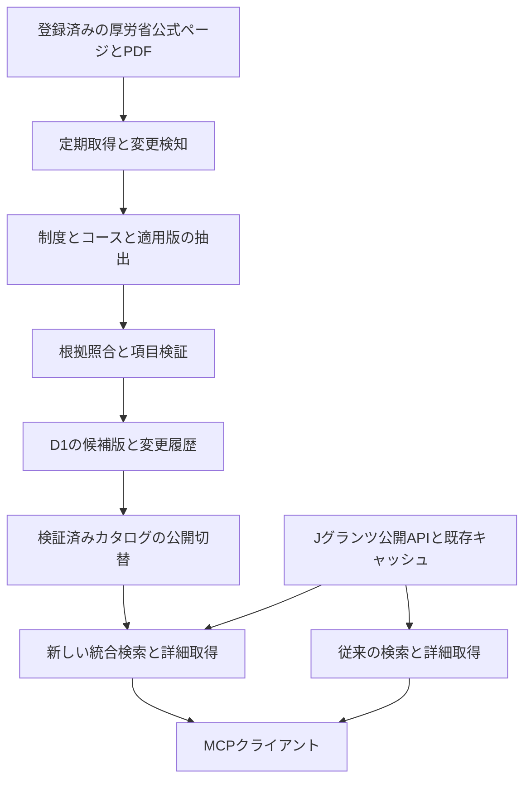

# 厚生労働省の雇用関係助成金を収集するMCP改善仕様案

作成日：2026年10月9日（日本時間）

対象：補助金AI MCPサーバーと後続のプラグイン更新

状態：改善仕様案。収集機能の実装、DB変更、本番配備、OpenAIへの更新申請は本書の作成に含まない。

## 1 目的と採用する設計

厚生労働省が公開する雇用関係助成金のHTML・PDFから制度情報を定期収集し、出典と適用時期を付けてD1に保存する。Jグランツだけでは発見できない制度も、補助金AIのMCPを通じて検索・詳細確認できるようにする。

**MCP側の収集基盤と検索機能は、プラグインZIPの更新・審査完了を待たずに先行配備できる設計とする。** 既存ツールの契約を維持し、収集、データ公開、新ツール公開を独立した設定で切り替える。新しい同梱スキルや比較UIを、収集・DB保存・基本検索の必須条件にしない。

採用する構成は次のとおり。

1. 既存のJグランツ検索・詳細取得を維持する。
2. 厚労省の公式情報を蓄積するカタログを追加する。
3. 既存の発見漏れ対策案で提案済みの `discover_subsidies` と `get_discovered_subsidy_detail` に、このカタログを接続する。
4. 新機能を非公開のまま本番へ先行配備し、収集品質を確認する。
5. MCPのツール更新を公開する。OpenAI側で利用可能になったことを確認してから、新しい検索導線を案内する。
6. プラグインの説明・同梱スキル・比較UIの更新は、別のパッケージ更新として後から行う。

本書でいう「対応」は、公式情報に基づく制度探索・概要・条件・資料・確認事項の提供を指す。支給決定、受給資格の保証、電子申請の代理実行は含めない。

## 2 現状と既存対策との関係

### 2.1 確認した実装

2026年10月9日のローカルコードは `0.13.0`、確認したコミットは `f1027e2`。本番の配備版・フラグ・DB適用状態・OpenAI側の承認状態は、リリース時に別途照合する。

| 対象 | 現状 | 本改善での扱い |
|---|---|---|
| `src/jgrants.ts` | Jグランツ公開APIの検索・詳細と一時キャッシュ | 取得元を厚労省へ置き換えず、既存契約を維持 |
| `src/index.ts` | `get_subsidy_detail` 等は18文字以内の英数字JグランツIDを受け付ける | 厚労省IDを流用・偽装しない |
| `src/responseGuidance.ts` | 雇用・研修は標準Web検索で厚労省・労働局を補完する指示 | 新DBが利用できる場合の案内を追加。利用不能時のWeb補完は残す |
| 同梱相談スキル | 検索範囲の注意、採用・研修の事前手続き確認 | 旧スキルでも既存機能を利用可能にする。新スキルへの更新を先行配備の条件にしない |
| `src/officialDocuments/` | HTMLから公式資料リンクを収集しD1へ保存。本文解析ではない | URL制御、差分検知、実行履歴などを再利用。PDFの条件抽出は追加実装 |
| `OFFICIAL_DOCUMENTS_ENABLED` | trueのときだけ資料ツールを登録する | 非公開の先行配備方式を継承 |
| `DOCUMENT_DISCOVERY_ENABLED` | 資料収集を公開設定と分離 | 厚労省の収集も独立して停止・開始できるようにする |
| `SUBSIDY_COMPARISON_ENABLED` | 比較UIを条件付き登録する | 厚労省の基本提供をこのフラグに依存させない |

過去の[雇用関係助成金の調査](../research/jgrants-employment-audit-2026-09-07.md)では、2026年9月7日の条件で人材開発支援・キャリアアップ・特定求職者雇用開発の国の制度本体を発見できず、一方で業務改善助成金は取得できた。本書は「厚労省所管はすべてJグランツ未掲載」「省庁の連携拒否が確認済み」とは扱わず、**Jグランツで得られない情報も公式公開情報から補う**ことを要件にする。

### 2.2 既存仕様から引き継ぐもの

- [補助金検索の発見漏れ対策案](subsidy-discovery-improvement-plan-2026-09-12.md)の統合検索、安定ID、情報源別coverage、条件を固定したページ送りを継承する。本書はその厚労省取得部分と先行リリース条件を具体化する。
- [公式資料レジストリの運用手順](official-document-registry-operations.md)の、収集と公開の分離、公開フラグ無効時の未登録、前回正常結果の保持を継承する。
- 既存の資料登録スキーマはJグランツIDを必須としている。DBの `jgrants_subsidy_id` がNULL許容でも、そのまま厚労省の登録に使えるわけではない。厚労省向けの登録経路を別に設ける。

## 3 収集する公式情報と初期範囲

### 3.1 入口と情報の優先順位

| 情報源 | 用途 |
|---|---|
| [雇用関係助成金一覧](https://www.mhlw.go.jp/stf/seisakunitsuite/bunya/koyou_roudou/koyou/kyufukin/index_00057.html) | 制度・コースの発見、追加・廃止候補の検知 |
| [雇用関係助成金の申請にあたって](https://www.mhlw.go.jp/stf/seisakunitsuite/bunya/koyou_roudou/koyou/kyufukin/index_00018.html) | 共通要領、共通様式、申請先、併給に関する情報 |
| [雇用関係助成金支給要領](https://www.mhlw.go.jp/stf/seisakunitsuite/bunya/koyou_roudou/koyou/kyufukin/index_00026.html) | 現行要領・改正内容・過去版への参照 |
| 制度別・コース別ページとリンク先PDF | 対象、金額・率、申請段階、期限、必要な手続き、様式 |
| 都道府県労働局の公式ページ | 管轄窓口、地域固有の受付方法、追加案内。第2段階で対応 |

制度条件は適用対象の共通要領・個別支給要領・改正通知を照合する。概要パンフレット・FAQ・労働局の案内は補足として用いる。取得日時の新しさだけで優先順位を決めず、対象コース、取組日、施行日、経過措置を確認する。資料間の不一致が解消できない項目は `conflict` として公開値を確定しない。

公式ページでは実際に年度途中の改正や資料差替えが確認できる。人材開発支援助成金には2026年8月3日の改正案内があり、キャリアアップ助成金は取組日によって様式や金額が変わると案内している。両立支援等助成金も複数年度・複数時点の資料を掲載している。この構造を前提に版を分離する。出典：[人材開発支援助成金](https://www.mhlw.go.jp/stf/seisakunitsuite/bunya/koyou_roudou/koyou/kyufukin/d01-1.html)、[キャリアアップ助成金](https://www.mhlw.go.jp/stf/seisakunitsuite/bunya/koyou_roudou/part_haken/jigyounushi/career.html)、[両立支援等助成金](https://www.mhlw.go.jp/stf/seisakunitsuite/bunya/kodomo/shokuba_kosodate/ryouritsu01/index.html)。

### 3.2 初期対象

| 段階 | 対象 | 到達点 |
|---|---|---|
| 初期公開 | 人材開発支援助成金、キャリアアップ助成金、特定求職者雇用開発助成金 | 登録対象コースの発見、概要、適用版、公式資料、事前手続きの確認事項を提供 |
| 第2段階 | 両立支援等助成金、トライアル雇用、雇用調整、人材確保等支援など | 対応コースを増やし、労働局の受付案内を関連付ける |
| 将来 | JEED等の実施機関、労働条件等関係助成金 | 情報源別の利用条件と解析品質を確認して追加 |

初期の情報源登録時に、各系列の現行コース一覧と「詳細解析済み／概要のみ／未収集」を台帳へ記録する。系列名だけ登録して全コース対応と表示しない。特定求職者雇用開発助成金は、例えば[特定就職困難者コースの公式ページ](https://www.mhlw.go.jp/stf/seisakunitsuite/bunya/koyou_roudou/koyou/kyufukin/tokutei_konnan.html)のように、コースと雇入れ時期を区別して扱う。

ログイン後の雇用関係助成金ポータル、電子申請操作、申請者の添付書類、個人の雇用・医療・障害・マイナンバー情報は収集しない。個人向け給付制度や民間解説サイトは初期カタログの対象にしない。

## 4 全体構成



相談のたびに厚労省サイトを巡回しない。厚労省の検索はD1の公開済み情報を読む。Jグランツ取得に失敗しても厚労省候補を返し、厚労省DBに問題があってもJグランツの従来機能を継続する。情報源ごとの成功・失敗を結果へ残す。

HTML取得は既存Workerの定期処理へ追加する。PDFの解析は専用の非同期ワーカーへ分離し、キューで実行する案を採用する。MCP応答処理とPDF解析のCPU・メモリ・再試行を分離するためである。実装着手時に代表PDFで実行環境を検証し、必要なCloudflare Queues等の設定と費用を確定する。既存にキューやPDF解析環境が配備済みであるとは扱わない。

## 5 定期取得と更新処理

### 5.1 情報源の登録

運営者が管理する `config/mhlw-sources.json` に、入口URL、発行機関、許可ホストとパス、資料種別、対象系列、抽出設定、更新頻度、利用条件URLを登録する。利用者の入力URLをそのまま巡回対象にしない。

最初は `www.mhlw.go.jp` の登録範囲を対象とする。`jsite.mhlw.go.jp` や別の実施機関は追加登録する。ページで発見したリンクは、許可済み範囲・資料種別・対象制度との関連を検証してから収集対象にする。リンクがあるだけで別ドメイン全体を許可しない。

### 5.2 更新の流れ

1. 15分間隔の既存Cronで、次回取得時刻を過ぎた情報源を少量ずつ選ぶ。Cronの起動間隔と、同じページの取得間隔を分ける。
2. 情報源単位の実行権と期限をD1に保存し、二重実行を防ぐ。
3. ETag・Last-Modifiedがあれば条件付きGETを使う。HTTP 304は同じ資料の到達確認として扱う。
4. HTTP 200では受信した実バイト列のSHA-256、サイズ、MIME、転送後URLを記録する。全文を得ていない応答に完全取得のハッシュを付けない。
5. HTML本文・リンク集合・PDFの変更を別々に検知する。同じURLのPDF差替えを検知するため、HTMLが304でもリンク先PDFの確認時刻を独立に管理する。
6. 変更した資料から抽出し、制度・年度・コース・適用時期・共通要領との対応を検証する。
7. 検証済みの候補版を公開カタログへ反映する。失敗時は直前の公開版を維持し、警告状態を更新する。

サイト全体のナビゲーションや日付表示だけの変更で、制度条件を改正扱いにしない。一方、本文の抽出範囲や必要な見出しが消えた場合は、変更なしとして処理しない。

### 5.3 初期の運用設定案

| 項目 | 初期値と挙動 |
|---|---|
| 制度一覧・制度ページ・現行資料 | 原則24時間ごと。変更を検知した資料群は一時的に6時間ごと |
| 過去版 | 原則7日ごと、または改正リンクの変化時 |
| 鮮度 | 必要な根拠資料の確認成功から48時間。親ページだけの確認でPDFの鮮度を延長しない |
| ホスト負荷 | ホスト単位で同時1接続、リクエスト間隔2秒以上。ワーカー間でも共有制御 |
| 上限 | 初期は1ホスト500リクエスト／日。遅延が出たら対象と予算を見直し、coverageへ反映 |
| 通信 | HTMLは15秒・2MiB、PDFは60秒・30MiBを暫定上限。途中打切りは未解析 |
| 再試行 | 429はRetry-Afterを尊重。5xxは時間を空け最大3回。403やアクセス制限を回避しない |
| 解析資源 | PDFのページ数・CPU・メモリ上限を実データ検証で設定。超過は専用再処理へ回し正常終了にしない |

これらは本サービスの運用設定案であり、厚労省が示した許容量ではない。robots.txtや個別条件、応答状況がより厳しい場合はそちらを優先する。

厚労省の現行支給要領ページには19.3MBのPDFが掲載されている。小さなHTML取得上限をPDFに流用せず、大きな資料を処理できるかを初期の技術検証に含める。[雇用関係助成金支給要領](https://www.mhlw.go.jp/stf/seisakunitsuite/bunya/koyou_roudou/koyou/kyufukin/index_00026.html)

## 6 抽出と品質確認

### 6.1 HTMLとPDFの役割

HTMLからは、制度名、コース名、概要、掲載資料、年度見出し、改正・終了の案内、申請先を取得する。PDFからは、支給条件、費用区分、金額・率・上限、事前手続き、相対期限、併給制限などを取得する。リンク名だけから金額や資格を推測しない。

PDFのテキスト抽出はページ・表・注記の関係を保持する。複雑な表、画像PDF、文字化けは `needs_review` とする。初期版ではOCR必須資料を自動確定せず、資料リンクと未解析の状態を返す。様式のWord・Excel・ZIPはまずリンク情報を保存し、マクロ実行や無制限なアーカイブ展開をしない。

ルール抽出を先に行い、必要な場合だけAIで構造化・要約を補助する。AIは認証情報や公開操作の権限を持たず、固定スキーマの候補値だけを返す。モデル名・抽出器版・プロンプト版・入力ハッシュ・実行結果を残す。AIの確信度だけで公式確認済みにしない。

### 6.2 公開基準

| 情報 | 公開する条件 |
|---|---|
| 制度・コースの名称、公式URL | 許可済み公式ページの本文と一致し、対象・年度の関連が確認できる |
| 概要と検索タグ | 根拠のある説明に限定。タグは検索用で、資格判定に使わない |
| 金額・率・上限 | 対象費用、企業区分、人数・時間などの単位、加算・例外、適用期間、根拠位置を組にして検証 |
| 事前届出と期限 | 手続きの段階、起算イベント、日数・月数、営業日か暦日か、例外を原文と照合 |
| 廃止・終了・移行 | 明示された公式案内と適用対象を確認。404や一覧からの消失だけでは確定しない |

初回導入と重要条件の変更時は、金額・期限・資格に関する抽出結果を運営者が公式資料と照合する。同じ入力ハッシュ・抽出器版の正常結果は再利用し、通常の変更なし取得に承認操作を要求しない。日々の管理画面を増設することは必須にせず、既存方式に沿った管理コマンドと差分レポートで運用する。

制度の存在と概要は確認できても条件の解析が不十分な場合は、`overview_only` として公開できる。金額等の未確認値はNULLにし、公式資料へのリンクを案内する。これにより、PDFの全項目自動解析を待たずに発見漏れを改善する。

改正を検知して新条件が未確認の間は、影響する項目を `update_pending` とする。前回値を現在の確定値として表示せず、必要なら「旧版の参考値」として履歴側に残す。

## 7 保存するデータ

### 7.1 制度と適用版

制度系列、コース、年度・対象範囲、条件の適用版を分ける。検索候補の `candidateId` は安定した不透明ID、条件の改正版は `versionId` で表す。IDをURLや名称だけから作らず、URL変更・名称変更・Jグランツへの後日掲載でも同じ候補を追跡する。

| 項目群 | 主な保存項目 |
|---|---|
| 識別 | candidateId、programId、courseKey、公式名称、別名、sourceRecords、jgrantsId（確認できなければNULL） |
| 対象 | 目的タグ、対象事業主、企業区分、労働者区分の制度上の定義、全国／地域、実施機関 |
| 版 | fiscalYear（不明ならNULL）、versionId、effectiveFrom／To、施行日の原文、経過措置、後継版との関係 |
| 支援内容 | 対象費用、助成額・率・上限、単位、条件別の算定表、加算と併給調整 |
| 手続き | 計画届、取組開始、支給対象期間、支給申請、申請先、申請方法、資料リンク |
| 期限 | fixed／relative／unknown、起算イベント、期限ルール原文、構造化ルール、例外 |
| 根拠 | 公式URL、掲載元URL、資料名、ページ・節・表、短い根拠抜粋、資料ハッシュ、項目ごとの検証状態 |
| 時刻 | publishedAt、sourceUpdatedAt、retrievedAt、lastVerifiedAt、freshUntil、servedAtを分離 |

助成額は単一の `maximumGrant` に押し込めない。例えば「中小企業／それ以外」「1人当たり／1時間当たり／1事業所当たり」「基本額／加算」を保持する。未確認の0円・0%を作らない。

### 7.2 相対期限と適用判定

雇用関係助成金には、雇入れ・訓練・転換・支給対象期間等のイベントに依存する手続きがある。年度末を一律の締切にせず、次のように保持する。

```json
{
  "deadlineType": "relative",
  "triggerEvent": "training_start",
  "ruleText": "確認した公式資料の期限原文",
  "offsetValue": null,
  "offsetUnit": null,
  "calculationStatus": "not_verified",
  "evidenceIds": ["根拠レコードのID"]
}
```

これは型の例であり、特定制度の実際の期限を示すものではない。初期版は期限ルールの提供までを必須とし、個別日程の自動計算は検証済みルールがある場合に限定する。起算日や提出済みの手続きが不明なら、利用者に必要な情報だけ確認する。イベント日を指定しても、それだけで受給資格を判定しない。

制度状態、適用期間、申請可能性は別項目にする。`active` は制度が現行であること、`event_based` は申請が個別のイベントに依存することを表す。「現在の制度」と「この利用者が今申請できる」を同じ真偽値にしない。

### 7.3 追加するテーブル案

既存D1 `subsidy_ai_relations` に追加マイグレーションを行う。`public_api_cache` は再取得できる一時キャッシュであり、制度台帳や証拠履歴の保存先にしない。

| テーブル | 役割と制約 |
|---|---|
| `discovery_sources` | 許可URL・抽出設定・利用条件・取得頻度・実行権・最終成功／失敗。source_idを主キーとする |
| `discovery_candidates` | 安定ID、系列、コース、年度、対象範囲。既存subsidy_programs／subsidy_roundsとの対応は確認済みの場合だけ保存 |
| `discovery_candidate_versions` | candidate_id＋version_idに紐づく構造化情報、適用期間、公開可否。公開後の内容を上書きしない |
| `discovery_source_records` | 取得URL、資料ハッシュ、HTTP・MIME・サイズ、取得時刻、抽出器版。URL＋ハッシュで資料版を識別 |
| `discovery_evidence` | version_id、項目パス、source_record_id、根拠位置、短い抜粋、検証状態。重要値は根拠参照必須 |
| `discovery_aliases` | 系列／コースの別名・目的タグと根拠。名称だけの同一制度判定に使わない |
| `discovery_fetch_runs` | 取得・抽出・検証の実行履歴、件数、失敗種別、所要時間、再試行、解析費用 |
| `discovery_releases` と `discovery_release_items` | 公開カタログ版と、その版が参照する候補版の集合 |
| `discovery_active_release` | 現在公開するrelease_idへの単一ポインタ。検証済みの版にだけ切替可能 |

外部キー、IDの一意性、検証状態の列挙制約、金額・比率の範囲をDBとアプリで検証する。NULLを含む年度・コースの重複は正規化した識別キーで防ぐ。検索用索引は名称の正規化値、目的タグ、制度状態、年度、地域に設ける。小規模カタログの初期検索は決定的な語句・タグ検索とし、ベクトルDBを必須にしない。

候補版を準備してから、公開版のポインタを比較更新する。公開切替はDB内の原子的な処理とし、通信やAI処理を含めない。切替に失敗した部分状態を配信せず、検索中は同じrelease_idを参照する。戻す場合も旧公開版へポインタを戻す。

既存 `subsidy_rounds` は公募回のモデルであり、雇用系の相対期限をその受付開始・終了へ無理に写さない。既存資料レジストリとの結合は、確認済みの内部対応関係を介して行う。厚労省の新詳細ツールは、自身の根拠・資料リンクを直接返せるようにする。

### 7.4 保存範囲と履歴

D1に保存するのは構造化情報、短い根拠抜粋、URL、ハッシュ、履歴である。PDF・HTML全文の恒久保存や原本の代理配信は初期範囲に含めない。解析中の一時ファイルは処理終了または最大24時間で削除する。公開した構造化版と根拠は原則5年間、実行詳細ログは90日間を初期保持方針とする。

短い抜粋とハッシュでは、変更・消失した原本の完全な再現は保証できない。原本の長期保存が必要になった場合は、利用条件、保存先、公開範囲、保持期間を別に定める。

相談本文、検索語の平文、会社の非公開情報、従業員情報を制度台帳へ保存しない。検索キャッシュが必要な場合は既存の秘密鍵付きキー生成方式を使い、カタログ版・検索仕様版をキーに含める。

## 8 MCPの検索と詳細取得

### 8.1 既存ツールの互換性

`search_subsidies` の `source`、`subsidies`、件数、ID、受付状態はJグランツとしての意味を維持する。`get_subsidy_detail`、既存の適合度評価・採択統計・資料取得の入力型も変更しない。

厚労省候補を既存の `subsidies` 配列へ混ぜたり、厚労省のIDを英数字18文字へ短縮して既存詳細に渡したりしない。新しい統合結果は新ツールの契約で提供する。

### 8.2 新ツール

| ツール | 入力案 | 応答と挙動 |
|---|---|---|
| `discover_subsidies` | query、target_area、purpose_tags、sources、status_scope、limit、cursor | Jグランツと厚労省DBを検索。候補、情報源別coverage、件数、出典、版、鮮度を返す |
| `get_discovered_subsidy_detail` | candidate_id、version_id、event_date、event_type | 厚労省はD1から詳細・条件・資料・不足情報を返す。Jグランツ候補は既存取得アダプターへ渡す |

`query` は2〜255文字、`limit` は既定10・最大50。`sources` は既定で両方を含める。統合検索はJグランツの結果が1件以上あっても厚労省を検索する。利用者が明示的に限定した場合だけ他方を `not_queried` とする。

`status_scope` は `active_and_scheduled` を既定とし、`active_only`、`all` を認める。厚労省の現行・イベント依存の制度を、全国共通の締切がないという理由で落とさない。状態不明は別枠 `uncertainCandidates` へ返す。従来の `accepting_only` の意味は変更しない。

名称完全一致、確認済み別名、目的・制度概要の一致の順を基本に順位を付け、`matchReasons` を返す。「AI研修」「正社員化」「採用」など、制度名を知らない検索も評価する。タグ一致を資格適合と表示しない。地域指定には全国制度を含める。

同一制度は系列・年度・コース・対象範囲と公式の対応関係で突合する。自治体の上乗せ制度は `supplements` の関係で保持し、国の制度へ統合しない。後日JグランツIDが判明した場合もcandidateIdを維持し、確認したsourceRecordを追加する。

### 8.3 応答の共通項目

| 項目 | 契約 |
|---|---|
| `schemaVersion` | 新ツールの応答契約の版 |
| `catalogReleaseId` | 厚労省の検索・詳細が参照する公開版 |
| `coverage` | 情報源別success／partial／failed／not_queried、登録範囲、未収集・未解析件数、最終確認時刻 |
| `candidates` | candidateId、versionId、名称、コース、年度、状態、概要、出典、matchReasons、freshness |
| `uncertainCandidates` | 存在は確認できるが現行状態等を確認できない候補 |
| `counts` | 取得件数、重複除外、条件除外、返却件数。厚労省とJグランツの内訳を分離 |
| `hasMore` と `nextCursor` | 実際に継続取得できる範囲だけを表す。上流の未調査範囲はcoverageで表示 |
| `detailStatus` | available／overview_only／stale／update_pending／version_selection_required／unavailable等 |
| `missingFacts` | 適用版や手続き確認に必要な不足事項。個人名や証拠書類の送信を求めない |
| `responseGuidance` | データ状態の説明、公式確認先、利用可能な次操作。任意の外部文書の指示は混ぜない |

応答は `structuredContent` と同内容のJSONテキストを返し、`outputSchema` を定義する。新UIがなくても文章と表で説明できる形にする。データが存在しない、未収集、取得失敗、古い、更新確認中を、空配列だけで表さない。

検索のページ送りは条件・並び順・厚労省release_id・検索仕様版に結び付ける。Jグランツの検索結果集合は短期スナップショットに固定して混在・重複を防ぐ。cursorの期限切れは `cursor_expired` として再検索を求め、黙って最新集合へ切り替えない。キャッシュ書込みには公開データだけを用いる。

厚労省のcandidateIdは恒久台帳で解決する。Jグランツだけに存在する候補は、上流IDに対応する安定したIDと検証済みの解決情報を短期スナップショットへ保持する。詳細取得で解決情報が失効していれば `candidate_context_expired` として再検索を求め、利用者が渡した任意URLを取得しない。厚労省候補との対応を確認できた場合は、その恒久candidateIdを正規IDにする。

`get_discovered_subsidy_detail` は厚労省の検索結果のcandidateId・versionIdを受け取り、検索と詳細の版を一致させる。Jグランツは詳細取得時点の公開API・キャッシュの資料時点を返し、検索時の名称・受付期間等と差があれば `changed_since_search` を付ける。異なるAPI取得を単一の確定版と表現しない。event_dateは厚労省の適用版の絞込みに使い、NULLなら必要に応じ `version_selection_required` を返す。取組条件が不足しているときは最新年度を自動適用しない。

### 8.4 ツール注釈と副作用

新しい統合検索・詳細はJグランツ取得時に既存キャッシュを更新し得るため、初期版では両方とも既存の `INTERNAL_CACHE_ANNOTATIONS` と同じ4ヒント（readOnly=false、openWorld=true、destructive=false、idempotent=false）を使用し、説明文にも一時キャッシュ更新を明記する。厚労省の分岐がD1読取りだけでも、ツール全体を純粋な読取りと表示しない。

厚労省の公開検索から、巡回ジョブ・PDF解析・AI呼出し・カタログ公開を起動しない。収集管理・再処理・公開操作は運営用コマンドに限定し、一般のMCPツールとして追加しない。

## 9 利用者へ返す情報

回答には制度名・コース・対象時期・候補に挙げた理由・未確認条件・公式URL・確認時点を含める。取得したデータの範囲に応じて「概要を確認」「条件まで確認」「更新内容を確認中」を区別する。

採用・研修では、必要に応じて入社日、雇用形態、採用経路、研修開始日・内容・時間数・実施方法、雇用保険の適用、事前届出の状況を確認する。既知の情報を再質問しない。厚労省候補を既存のJグランツ専用の適合度スコアへ流さず、未確認事項を説明する。

専門家への確認が必要な場合は、既存 `prepare_professional_consultation` へ公開制度名・公式URL・確認済み事実・未確認論点を渡せるようにする。相談文の作成までとし、外部へ自動送信しない。

雇用系助成金に既存の採択率推計を機械的に適用しない。公募型の競争採択と、要件確認に基づく支給審査を区別する。比較UIでは表現できない相対期限や条件別金額を無理に数値へ変換せず、初期版は文章・表の代替表示を使う。

## 10 MCPを先行リリースする要件

### 10.1 必須の互換原則

**プラグインの審査・配布に時間差があることを通常運用として扱う。MCPの新版は、現在配布中の旧プラグインが使う承認済みのツール名・入力型・既存応答項目・意味を引き続き受け付ける。** 同梱スキル、プラグイン版、比較UIの更新をMCP起動時や検索時の必須条件にしない。

新ツール非公開時は `tools/list` に登録せず、直接 `tools/call` してもTool not foundとする。説明だけ非表示にする、呼べばunavailableになる形で一覧へ残す、といった実装は採用しない。

OpenAIの公式手順では、初回公開後のMCP変更は自動スキャン等の対象となり、対象となる更新はチェック通過後に利用可能になる。新ツールは承認まで利用できず、保留された既存ツール更新では以前の承認済みメタデータが維持される。プラグインのメタデータ・スキル変更は別のZIP更新となる。このため、サーバーへの配備完了を、新ツールの利用開始や新ZIPの審査完了と同一視しない。[OpenAIのプラグイン更新手順](https://developers.openai.com/plugins/deploy/submission)

### 10.2 追加フラグ案

| フラグ | 初期値 | 制御対象 |
|---|---|---|
| `MHLW_INGESTION_ENABLED` | false | 定期収集と解析キューの投入 |
| `MHLW_AI_EXTRACTION_ENABLED` | false | AIによる構造化補助。ルール抽出とは分離 |
| `MHLW_CATALOG_SERVING_ENABLED` | false | 公開済みカタログの外部提供 |
| `SUBSIDY_DISCOVERY_TOOLS_ENABLED` | false | 統合検索・新詳細の2ツールの登録 |
| `MHLW_DISCOVERY_GUIDANCE_ENABLED` | false | 既存応答から新ツールへ案内するサーバー側ガイダンス |

trueという完全一致だけを有効とする。未設定・不正値は無効。既存の資料収集・資料公開・AI分類・比較UIの各フラグは維持する。厚労省のフラグを変更して他の公開済み機能を停止しない。

公開フラグと収集フラグは独立してよい。収集停止中も公開版を読み取れるが、鮮度は時間経過でstaleになる。ツール公開が有効でもDB未適用・公開版なしなら、理由付きunavailableを返し、MCP全体の初期化を落とさない。すべて無効の先行配備では、新テーブルを参照せず既存DBだけで動作する。

### 10.3 配備順序

| 段階 | MCP側 | OpenAI・プラグイン側 | 完了確認 |
|---|---|---|---|
| A 非公開の先行配備 | 新コードを全追加フラグfalseで配備 | 現行ZIP・同梱スキルを維持 | 既存ツール一覧・入力・説明・注釈の基準差分がない |
| B DB準備と収集 | 追加テーブルを適用し情報源を登録。収集のみ有効 | パッケージ更新不要 | 実在資料から候補・根拠・履歴を保存、非公開状態を維持 |
| C カタログ検証 | 候補版を検証し公開版を準備。テスト接続で新ツールを確認 | 開発用接続で検証 | 正式名称と目的語の検索、詳細、鮮度、旧版互換を確認 |
| D MCPツール公開 | データ提供・新2ツールを有効化 | MCPをRescan等で確認し、各ツールのLive状態を確認 | MCP直接呼出しとChatGPT上の利用可能状態を別々に記録 |
| E 旧プラグインでの案内 | 利用可能確認後に新検索へのガイダンスを有効化 | 現行配布ZIP・旧スキルで会話試験 | 新ツールなしでも従来機能が動き、新ツールありなら検索できる |
| F パッケージの後続更新 | 同じMCPを継続提供 | 厚労省対応の説明・スキル・必要なら比較UIを新版で審査・配布 | 新旧の両方で確認し、移行を完了 |

初回公開前・審査中等でMCP更新機能の適用条件を満たさない場合も、A〜Cのサーバー先行配備・収集は独立して進められる。D以降の提供開始日は、実際の審査状態に従う。

旧スキルが新ツールを知らない場合の動作は、サーバーのツール説明と応答ガイダンスで補う。ただしモデルのツール選択を保証できるとはしない。ガイダンスは「利用可能な場合に統合検索を使う」と条件付きにし、新ツールが利用できない接続では従来のJグランツ＋標準Web補完へ戻る。ガイダンス有効化はサーバーのtools/listだけで判断せず、OpenAI側の反映と実会話を確認して運営設定で切り替える。

既存結果に厚労省データを混ぜることや、ツール結果へ指示を書いて審査を回避することを先行提供の手段にしない。先行配備の独立性と、提供先の正規の更新手順を両立させる。

### 10.4 リリース記録と戻し方

サーバー版、Gitコミット、DB migration、公開catalogReleaseId、フラグ、MCPツール契約ハッシュ、OpenAIで利用可能なツール、配布プラグイン版・スキルのハッシュを別項目として記録する。

ツール数は固定の15件を恒久基準にしない。配備直前の承認済み・配布中の一覧を基準N件として、AではN件、DではN＋2件であることと全定義の差分を確認する。資料・比較ツールの有効状態によってNは異なる。

誤ったデータだけを戻す場合は公開版ポインタを以前へ戻す。収集障害なら収集だけ停止する。提供を止める場合はまず案内とカタログ提供を停止し、承認済み新ツール自体は理由付きunavailableを返せる状態を維持する。ツールの削除は接続先の反映遅延を考慮し別途実施する。緊急に登録フラグをfalseへ戻した場合、キャッシュされた呼出しはTool not foundになり得ることを障害記録へ残す。既存Jグランツ機能は継続する。

DBは追加変更を基本とし、戻すために既存テーブルを削除・再作成しない。サーバー旧版へのロールバックも、新テーブルを無視して動作できることを検証する。

## 11 利用条件とセキュリティ

厚労省の利用規約は、特記等がない公開情報について公共データ利用規約PDL1.0に準拠し、出典と加工の明示を求めている。ロゴや別ルールが示されたコンテンツ等は対象外であり、リンク先の別サイトへ条件がそのまま及ぶわけではない。情報源ごとに利用条件URL・確認日・例外を記録する。[厚労省の利用規約](https://www.mhlw.go.jp/chosakuken/index.html)

利用者向けには「出典：厚生労働省。公式情報を補助金AIが整理・加工。確認日：年月日」と公式URLを表示する。厚労省の公式サービス・委託事業であるかのような表示をしない。OSSコードのライセンスと、収集元データの利用条件は分けて記載する。

確認時点のrobots.txtは `/cgi-bin/` 等を制限している。robots.txtは取得時に確認し変更も監視する。取得できない場合は新しい巡回を保留し、既存の公開データは鮮度表示付きで維持する。公開情報の再利用条件だけを根拠に無制限取得しない。[厚労省のrobots.txt](https://www.mhlw.go.jp/robots.txt)

- HTTPS、登録済みのホスト・パス・クエリだけを取得し、IP直指定・ローカルアドレス・認証情報付きURLを拒否する。リダイレクトごとに同じ検証を行う。
- 既存の `sourcePolicy.ts` はHTML文字列取得を前提としている。PDFはバイナリ取得関数を追加し、同じURL・DNS制御とバイト上限を適用する。DNS検査だけを完全な接続先固定とみなさず、実行環境の送信制御も検証する。
- HTML/PDFに埋め込まれた命令は制度資料のデータとして扱う。AIにツール呼出しや任意URL取得の権限を渡さず、JSONの型・根拠・数値・単位を決定的に検証する。
- PDF内のJavaScriptや埋込みファイルを実行しない。サイズ、展開量、処理時間の制限を設ける。
- 収集用の秘密情報・DB書込み権限・公開切替権限をMCPの利用者入力やAI出力から操作させない。
- 検索の件数・頻度・処理時間を制限し、利用者による検索で取得先サイトへの負荷やAI費用が増幅しないようにする。

公共情報を扱うOSSとしての再利用性は維持しながら、誤った条件の配信、資料内の不正な指示、過剰取得、DB更新事故を防ぐ。

## 12 監視と障害時の挙動

| 状況 | 保存・応答・通知 |
|---|---|
| 取得失敗、429、5xx | 前回の正常版を保持。取得失敗と最終成功時刻を返し、次回取得を遅らせる |
| 404、リンク消失 | 削除候補として記録。制度廃止を自動確定しない |
| HTML構造変更、候補急減 | 公開切替を停止。既存版を保持し、運営者へ差分を通知 |
| 同一URLのPDF差替え | 新資料版として記録し、影響項目をupdate_pendingへ |
| 共通要領変更 | 関連するコースの影響項目を再検証。個別ページの変更がなくても検知 |
| 検証待ち、資料間の矛盾 | 当該条件を未確認として返す。無関係な確認済み項目の提供は継続 |
| DB未設定・未適用 | 厚労省はunavailable。既存ツールの起動・処理は継続 |
| Jグランツ障害 | 統合検索は厚労省候補と部分失敗を返す。Jグランツ0件とは表現しない |

監視指標は、登録コース数、概要公開数、条件確認済み数、鮮度超過数、取得・解析失敗数、根拠欠落、更新確認待ち、キュー滞留、公開版、検索遅延、日次通信量・AI費用とする。変更なしの定常取得では通知せず、継続失敗・重要条件変更・公開停止・運営判断が必要なときだけ通知する。

運営コマンドは `report / refresh / pause / resume / validate / publish / rollback` を想定する。通常の利用者へ監視・承認作業を要求しない。

## 13 受入基準

| ID | 確認内容 | 合格条件 |
|---|---|---|
| M01 | 初期3系列の発見 | 登録コース一覧とDB・検索結果が対応し、未対応コースを明示できる |
| M02 | 目的からの検索 | AI研修、社員の正社員化、採用等の評価集合で、制度名なしでも想定候補と根拠を返す |
| M03 | 正式名称検索 | 各登録コースの正式名・確認済み別名で目的候補が上位に出る |
| M04 | Jグランツに結果がある場合 | 自治体の上乗せ制度が返っても国の厚労省制度を併せて探索する |
| M05 | 年度と改正 | 同一URL差替え、同一年度の複数版、経過措置を混同しない |
| M06 | 相対期限 | 起算イベント不明を固定締切へ変換せず、必要な確認事項を返す |
| M07 | 数値と根拠 | 公開する金額・率・期限・資格の全項目に、対象条件・資料版・根拠位置がある |
| M08 | PDF解析 | 代表のテキストPDF・複雑表・画像PDF・大容量PDFで、成功と未解析を正しく区別する |
| M09 | 更新失敗 | 429、403、5xx、タイムアウト、構造変更、候補0件で正常版を消さない |
| M10 | 304と添付更新 | 親HTMLが304でもPDFの独立確認を行い、PDF差替えを検知できる |
| M11 | 不正入力 | 未登録ホスト、内部IP、危険な転送、過大PDF、資料中の命令を遮断する |
| M12 | 冪等な収集 | 重複ジョブ・リトライで同じ候補を増殖させず、公開版が混在しない |
| M13 | 先行配備の契約 | 全追加フラグfalseで配布中ツール定義と一致し、新ツール直接呼出しはTool not found |
| M14 | DB非依存 | 新テーブル未適用でも追加フラグfalseなら既存機能が動く |
| M15 | 旧プラグイン | 現行配布ZIP・旧スキルで従来の検索・詳細・相談作成が動く |
| M16 | OpenAI反映前 | 新ツールが未承認・保留中でも既存機能が動き、利用不能ツールを必須にしない |
| M17 | OpenAI反映後 | 実際に利用可能な新ツールで、旧スキルの会話から厚労省の検索・詳細を確認できる |
| M18 | ロールバック | 収集停止、カタログ旧版への復帰、提供停止で既存機能を壊さない |
| M19 | 保存境界 | DB・ログ・キューに相談本文・従業員情報・秘密値・不要な原本が残らない |
| M20 | 障害の分離 | 一方の情報源の障害でも他方の結果と部分失敗を返す |
| M21 | ページ送り | 条件・版を固定し、重複・取りこぼし・期限切れcursorの黙示更新がない |
| M22 | 内容の実地照合 | 初期公開の全コースと重要条件を公式資料と照合し、代表会話の出典リンクも開ける |

初期の性能目標は厚労省D1検索単独でp95が1秒以内、統合検索は外部API込みで20秒を上限とする。取得・キューが正常なら日次更新対象の変更を原則24時間以内に検知する。実測環境、対象件数、遅延・失敗を記録し、目標を実績と混同しない。

既存の `npm test`、型チェック、Workerのdry-runに加え、fixtureによる取得・抽出・移行・公開切替の試験、実資料での品質確認、本番MCP、旧プラグインの実会話を別々に記録する。単体テスト成功だけで厚労省対応の提供完了としない。

## 14 実装時の変更対象

以下は実装開始時のファイル案。既存機能は本書の作成では変更しない。

| 対象 | 予定変更 |
|---|---|
| `src/index.ts` | 新2ツールの条件付き登録、定期処理の追加、情報源ごとのエラー分離 |
| 新規 `src/subsidyDiscovery/` | 共通候補型、統合検索、ID対応、詳細、coverage、cursor |
| 新規 `src/officialSources/mhlw/` | 取得、HTML抽出、PDF処理連携、適用版解析、根拠検証 |
| 新規 `src/officialSubsidyCatalog/` | D1アクセス、候補版、公開版、検索索引、履歴 |
| `src/officialDocuments/sourcePolicy.ts` 等 | 既存の安全な取得部品を抽出・共用。資料登録契約は維持 |
| 新規PDF解析ワーカーと設定 | キュー消費、バイナリ処理、資源制限、再試行 |
| 新規 `migrations/0005_mhlw_discovery_catalog.sql` | 追加テーブルと索引。番号は実装時の最新履歴に合わせる |
| 新規 `config/mhlw-sources.json` | 情報源、対象コース、許可範囲、抽出器、利用条件 |
| 新規 `scripts/mhlw-admin.mjs` | 登録、検証、差分確認、公開、停止、復旧 |
| `src/responseGuidance.ts` | 新機能が利用可能な場合の導線と、利用不能時の従来経路 |
| `wrangler.jsonc` | 追加フラグ、PDFワーカー連携。既存Cronとフラグを保持 |
| `test/`、検証スクリプト | 上記M01〜M22、既存契約の比較、公開モード別の実地確認 |
| 後続の `plugins/subsidy-ai/`、申請定義、README・ポリシー | 実際の公開範囲に合わせた説明と同梱スキルの更新。先行配備とは別工程 |

## 15 実装の優先順と完了の区分

最初に公開中のツール契約を保存し、初期3系列の対象コースと公式資料を登録する。次にHTMLの制度発見・D1保存・概要検索を実装し、新機能非公開で配備する。その後、PDFの代表資料を検証し、項目別の根拠と適用版を整備してMCPの検索提供を開始する。

「概要検索の初期公開」は、制度の発見・公式URL・対応範囲・未確認事項を提供できる状態とする。「条件情報の公開」は、金額・期限等を第6章の基準で検証した状態とする。「プラグイン更新完了」は、パッケージの審査・配布と実会話での確認が済んだ状態とする。この3つを分けて進捗を報告する。

本改善の最小完成範囲は、初期3系列について、Jグランツ掲載の有無に依存せずMCPで制度とコースを発見でき、公式根拠と適用時期を確認できること、および旧プラグインを維持したままMCP側の配備・収集・提供を段階的に進められることである。
