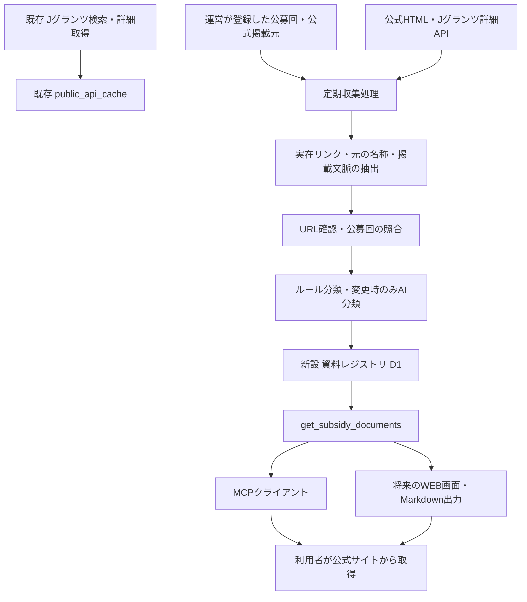

# 補助金AI：公式資料ダウンロード情報の共通キャッシュ実装仕様

作成日：2026年9月27日  
対象：`subsidy_ai_plugin`／Phase 1A（MCP側の公式資料ナビ）  
状態：設計時の仕様。0.12.0のローカル実装を追加済み。物理保存形式・設定・運用上の補足は[実装・運用手順](official-document-registry-operations.md)を参照。本番配備・運営承認とは別。  
確認基準：ローカル作業ツリー、`package.json` のバージョン `0.11.0`、HEAD `05d5476`。未コミットの変更があるため、HEADだけを調査対象の識別子とはしない。本番DB・稼働機能は今回未確認。

## 1. 実装方針と優先順位

**公式ファイルそのものではなく、公式のダウンロード先、掲載元、公募回、資料種別、短い用途説明、確認状態をMCP側で保存し、全利用者で共有する。**

共有できる前提は「全利用者が同じ書類を提出すること」ではない。「同じ公募回の、同じ掲載箇所にある資料について、出典と説明を共有できること」である。企業別に必要な書類を選ぶ機能はPhase 2に分ける。

実装順序は次のとおりとする。

1. **P0：公募回と公式掲載元を登録する。** 既存の制度・公募回テーブルを再利用し、対象を少数の制度に限定する。
2. **P0：リンクを抽出・確認・保存する。** 直リンクと掲載ページを区別し、元の名称・確認日時だけでも利用できるようにする。
3. **P0：MCPで保存済み一覧を返す。** 未収集、収集失敗、期限切れ、公募回の曖昧さを区別する。
4. **P1：AIによる分類と用途説明を追加する。** 共通の根拠が変わった場合だけ再分類する。
5. **P1：定期更新・変更履歴・運用確認を整える。** 本仕様の受入条件を満たしてPhase 1Aを提供する。

P0は内部検証可能な最小構成、P0＋P1をPhase 1Aの提供範囲とする。P0のみをもってAI分類・定期更新まで完成したとは扱わない。

| 区分 | 内容 |
|---|---|
| 既存 | Jグランツ検索・詳細取得、D1公開情報キャッシュ、制度・公募回テーブル、MCP公開基盤 |
| 今回開発：Phase 1A | 公式掲載元の登録、リンク収集、確認状態・分類結果の保存、更新処理、資料一覧取得MCP |
| 次段階：Phase 1B | WEBの申請準備ページ、同じ一覧の表示、出典付きMarkdown出力 |
| 将来拡張：Phase 2以降 | 企業別の必要資料判定、必須書類の充足判定、記入箇所の対応付け、申請書ドラフト作成 |

## 2. 現行実装から確認できたこと

参照会話の構成案を、そのまま新規実装項目とはしない。現行コードには次の基盤がある。

| 項目 | 確認結果 | 今回の対応 |
|---|---|---|
| `public_api_cache` | 正規化JSON、内容ハッシュ、取得時刻、通常期限、障害時の猶予期限を保持。更新時に期限超過行を最大100件削除 | 既存用途を維持。資料レジストリをこの削除対象に含めない |
| Jグランツ検索キャッシュ | 通常30分、取得から24時間まで一時障害時の古い応答を許容 | 今回の更新周期と分離 |
| Jグランツ詳細キャッシュ | 通常6時間、取得から72時間まで一時障害時の古い応答を許容 | 資料の確認済み日時に転用しない |
| 添付資料 | `application_guidelines`、`outline_of_grant`、`application_form`から種別・名称・APIデータ有無・概算サイズを返す | 直リンクの管理を追加。Base64本体を保存・配信しない |
| 詳細HTML | `htmlToText()`でテキスト化。アンカーの`href`は保持されない | 原文をメモリ上で解析する別の抽出経路を用意 |
| 公募回 | `workflow`配列にID・公募回表記・受付期間を保持 | JグランツIDと公募回を1対1と仮定しない |
| `subsidy_programs`、`subsidy_rounds` | `0003_subsidy_research_schema.sql`で作成済み | 同名テーブルを新設せず再利用 |
| 公募回の制約 | 年度・公募回名が必須。JグランツIDの索引は一意ではない | 年度不明を仮の年度で登録しない。曖昧な対応付けを保留 |
| 公式取得処理 | 採択実績用の公式URL取得・根拠照合処理がある | 参考にするが、新しい資料収集では掲載元ごとの許可範囲と転送前検証を追加 |
| 実行基盤 | Workers＋D1。`PUBLIC_CACHE ?? subsidy_ai_relations`を使用 | 同じD1を初期構成で利用可能。新機能にはD1を必須とする |
| 定期処理・AI分類 | 現在のWorker設定にCron登録なし。資料分類用のモデル呼び出しもなし | 新規実装・設定が必要 |

Jグランツの公式API資料でも、添付は`name`と`data`の形で示されている。これを「安定した公開ダウンロードURLが必ず返る」と解釈しない。添付は詳細オブジェクト直下、`workflow`は別配列なので、添付を全公募回共通と決めつけない。[デジタル庁 JグランツAPI仕様](https://developers.digital.go.jp/documents/jgrants/api/)

## 3. Phase 1Aの機能境界

### 3.1 提供する情報

- 選択した制度・公募回に関連付けて確認した公式資料の一覧。
- 原文の資料名、表示用タイトル、資料種別、短い用途説明。
- 公式ファイルURLと、そのリンクを実際に確認した掲載ページURL。
- 直リンクがない場合の公式掲載ページへの導線。
- 公募回・申請枠の公開情報、申請前／申請時／採択後などの資料の段階。
- 掲載確認日時、リンク疎通確認日時、公式に記載された更新日。
- 未分類、回の対応未確認、期限切れ、リンク切れなどの状態。

### 3.2 今回含めない処理

ファイル本体の永続保存、代理ダウンロード、ZIPへの同梱、Base64配信、ファイル内容の再生成、PDFやWord・Excel内部の読解、ファイル破損検査、マクロ検査は対象外とする。

企業別の必須・不要判定、必要資料がすべて揃ったという保証、申請可能という判定も対象外とする。公式が明記した「特定の申請枠向け」といった条件は原文に基づく注記として保持できるが、利用者への適用判定には使わない。

初期収集は**登録済みの公開HTMLページとJグランツ詳細API**に限定する。ログイン、CAPTCHA、フォーム送信、ブラウザー操作、PDF内のリンク抽出、サイト全体の自動巡回は扱わない。対応できない場合も公式ページへの入口を残す。

### 3.3 ユーザーへの表現

標準表現は「この公募回の公式掲載ページで確認した資料です」とする。「あなたの必要書類一式」「これだけで申請できます」「最新版を保証」とは表現しない。

自社による原本の複製配布を行わず、利用者が公式サイトから取得する構成とする。リンク先の利用条件や自動取得条件まで無条件に解消されたという法的判断は、この仕様では行わない。

## 4. 全体構成



初期構成は既存Worker、既存D1、新規4テーブル、Cron、1つの公開MCPツールとする。R2、Queues、Durable Objects、ブラウザー実行基盤は初版の必須構成にしない。

公開側は`get_subsidy_documents`でD1を読むだけとする。キャッシュミスからWeb収集、AI分類、ジョブ登録を自動発火させない。対応制度は運営が登録して事前収集する。これにより、公開MCPへのアクセス回数と収集・AI費用を分離する。

会話で提案された`discover_subsidy_documents`に相当する処理は、**内部の収集サービス**として実装する。公開`tools/list`には追加しない。対象追加と再実行は、運営の設定ファイル・管理スクリプト・定期処理から行う。一般利用者が任意URLやAI分類結果を共有DBへ書き込む経路は設けない。

## 5. データモデル

### 5.1 保存単位と既存テーブルの利用

既存の制度・公募回の下に、掲載元と収集時点ごとの資料情報を追加する。

```text
subsidy_programs                    既存：制度系列
  └─ subsidy_rounds                 既存：年度・公募回・申請枠
       └─ official_document_sources 新規：公募回に対して承認した掲載元
            └─ document_discovery_runs 新規：収集の各試行
                 └─ official_documents 新規：その試行で確認した資料メタデータ

subsidy_round_documents              新規：資料と公募回の対応根拠
```

初版では掲載元を公募回単位で登録する。同じページを複数公募回で使う場合も、登録を分ける。これは公式ページ内に前年度・別枠・採択後資料が混在するためである。取得通信の共通化は将来可能だが、公募回の対応付けを省略しない。

`official_documents`はファイル実体のマスターではなく、**特定の掲載元・収集時点におけるリンク情報のスナップショット**である。同じURLでも別公募回・別掲載文脈なら別レコードとなる。ファイルの同一性をURLや名称だけで保証しない。

### 5.2 共通ルール

- 新規IDは原則UUIDをTEXTで保存。既存`subsidy_round_id`のみINTEGER。
- 日時はUTCのISO 8601で保存・返却。画面側で日本時間に変換する。
- ハッシュはSHA-256、小文字16進64文字。真正性を保証する署名とは扱わない。
- 不明な値はNULL。架空の年度、更新日時、ファイルURLを補わない。
- 公開資料のメタデータと短い根拠だけを保持し、企業情報、利用者ID、相談内容を保存しない。
- 現在参照中のスナップショットは期限切れキャッシュの一括削除対象にしない。

### 5.3 `official_document_sources`：承認した公式掲載元

| フィールド | 型・必須 | 内容 |
|---|---|---|
| `id` | TEXT PK | 掲載元登録ID |
| `subsidy_round_id` | INTEGER FK、必須 | 既存公募回への参照 |
| `source_kind` | TEXT、必須 | `official_html` / `jgrants_detail` |
| `source_page_url` | TEXT、必須 | 利用者が開く掲載ページ。Jグランツなら制度詳細画面 |
| `fetch_url` | TEXT、必須 | 実際に取得するHTMLまたは固定構成のJグランツAPI URL |
| `publisher_name` | TEXT、必須 | 公式実施機関名 |
| `jgrants_workflow_id` | TEXT、NULL可 | 対応を確認できたworkflowのID |
| `registration_status` | TEXT、必須 | `pending` / `approved` / `paused` / `revoked` |
| `trust_evidence_url`、`trust_evidence_note` | TEXT | 公式機関からの案内など、掲載元を信頼する根拠 |
| `approved_at`、`approval_revision` | TEXT、INTEGER | 運営が確認した時刻と設定版 |
| `round_binding_hash` | TEXT | 承認時の制度系列・年度・回・枠・JグランツID・workflow対応のハッシュ |
| `fetch_policy_json` | TEXT、必須 | ページ／ファイル別の許可ホスト・パス・必要な公開クエリ・転送先 |
| `extractor_config_json` | TEXT、必須 | 抽出対象領域、見出し・回の対応ルール、セレクター、版 |
| `active_run_id` | TEXT、NULL可 | 現在の一覧を構成する正常完了スナップショット |
| `last_attempt_at`、`last_success_at` | TEXT、NULL可 | 最終試行と正常な掲載確認の時刻 |
| `last_attempt_status`、`last_error_code` | TEXT、NULL可 | 最新試行の状態。過去の成功と区別 |
| `next_refresh_at`、`failure_count` | TEXT、INTEGER | 次回実行時刻、連続失敗数 |
| `lease_token`、`lease_until` | TEXT、NULL可 | 重複収集と古い処理の公開を防ぐ実行権 |
| `created_at`、`updated_at` | TEXT、必須 | 管理時刻 |

一意制約は`(subsidy_round_id, source_kind, fetch_url)`。定期処理用に`(registration_status, next_refresh_at)`、参照用に`subsidy_round_id`の索引を設ける。

公募回そのものが未確定の掲載元候補は設定ファイルの未登録候補として保持し、このテーブルへはまだ挿入しない。テーブル内の`pending`は「公募回IDは確定したが、掲載元の承認が未完了」を意味する。これにより、既存公募回の必須年度を仮の値で埋めずに済む。

`active_run_id`は同じ`source_id`の公開可能なrunのみを指す。DBの複合参照制約または更新時の条件付きSQLで他の掲載元のrunを拒否する。公募回削除はRESTRICTとし、既存統計操作に伴って資料が連鎖削除されないようにする。

### 5.4 `document_discovery_runs`：収集試行とスナップショット管理

| フィールド | 型・必須 | 内容 |
|---|---|---|
| `id`、`source_id` | TEXT PK / FK | 試行IDと掲載元 |
| `status` | TEXT、必須 | `running` / `succeeded` / `not_modified` / `partial` / `failed` / `superseded` |
| `started_at`、`finished_at` | TEXT | 試行日時 |
| `source_observed_at` | TEXT、NULL可 | 実際に上流を確認した時刻。古いキャッシュの再読込では進めない |
| `http_status`、`final_url` | INTEGER / TEXT | ページ取得結果。転送は別途許可検証済みであること |
| `page_body_hash` | TEXT、NULL可 | HTML本文の変更検知用。本文は保存しない |
| `link_set_hash` | TEXT、NULL可 | 抽出リンクと掲載文脈の正規化結果のハッシュ |
| `etag`、`last_modified` | TEXT、NULL可 | 条件付き再取得用。公式の更新日とは別項目 |
| `extractor_version`、`approval_revision`、`round_binding_hash` | TEXT / INTEGER | 試行が使った設定と公募回対応 |
| `extraction_complete` | INTEGER、必須 | 登録領域を最後まで解析できたか。全必要書類の網羅とは無関係 |
| `candidate_count`、`published_count`、`unclassified_count` | INTEGER、必須 | 件数。非負制約 |
| `warnings_json`、`error_code` | TEXT、NULL可 | 上限超過、解析失敗、回不一致などの短い記録 |
| `request_count`、`ai_call_count`、`ai_usage_json` | INTEGER / TEXT | 通信・分類の消費量。本文・秘密情報は含めない |

### 5.5 `official_documents`：リンク情報と分類結果

| フィールド | 型・必須 | 内容 |
|---|---|---|
| `id`、`run_id` | TEXT PK / FK | スナップショット内レコードIDとrun |
| `document_key` | TEXT、必須 | 同じ掲載元内での資料追跡キー。返却時の`document_id`に使用 |
| `resource_kind` | TEXT、必須 | `file_link` / `web_page` / `api_attachment` |
| `file_url` | TEXT、NULL可 | HTML等で実在を確認した直接取得先。推測生成禁止 |
| `source_page_url` | TEXT、必須 | 当該リンクを掲載していたページ。API添付ならJグランツ詳細画面 |
| `resolved_url` | TEXT、NULL可 | 最終疎通確認時の許可済み転送先。期限付きURLは永続化しない |
| `original_title`、`file_name` | TEXT / TEXT NULL可 | リンクの原文名、公式に確認できるファイル名 |
| `file_type`、`file_type_basis` | TEXT、NULL可 | `pdf/docx/xlsx/doc/xls/zip/html/unknown`等と根拠。拡張子だけならその旨を保持 |
| `mime_type` | TEXT、NULL可 | 確認時のContent-Type。ファイル内容の保証ではない |
| `document_type` | TEXT、必須 | 後述の種別。未判定は`other` |
| `display_title`、`purpose_summary` | TEXT / TEXT NULL可 | 表示名、120文字以内の説明 |
| `classification_status` | TEXT、必須 | `rule_classified` / `ai_classified` / `operator_reviewed` / `unclassified` / `failed` |
| `classification_input_hash` | TEXT、必須 | 分類入力・文脈・各仕様版のハッシュ |
| `classification_model`、`prompt_version`、`classification_version` | TEXT、NULL可 | 再現・再分類のための版情報 |
| `classified_at`、`classification_evidence_json` | TEXT、NULL可 | 分類日時、使った短い原文断片 |
| `source_published_at`、`source_updated_at` | TEXT、NULL可 | 公式が日付の意味を明示した場合のみ。HTTPヘッダーから代入しない |
| `discovered_at`、`source_last_seen_at` | TEXT、必須 | 初回発見時刻、掲載を最後に実確認した時刻 |
| `link_status` | TEXT、必須 | `reachable` / `unverified` / `broken` / `blocked` / `not_direct` / `unsafe` |
| `link_last_checked_at`、`link_last_success_at` | TEXT、NULL可 | リンク確認試行と成功の時刻 |
| `link_http_status`、`link_check_method` | INTEGER / TEXT NULL可 | ステータスと`HEAD` / `bounded_get` |
| `link_fresh_until` | TEXT、NULL可 | リンク疎通の再確認期限 |
| `metadata_hash` | TEXT、必須 | 公開メタデータの変更検知用 |

一意制約は`(run_id, document_key)`。`classification_input_hash`と`document_key`に再利用・履歴照会用の索引を設ける。

`document_key`は掲載元ID・正規化された資料URL・掲載セクション識別子から計算する。相対URLを絶対化してホスト名等を標準化するが、意味のあるクエリやフラグメントは無断で削除・並べ替えない。API添付に安定IDがない場合は添付種別・原文名・同名内の出現番号を使い、同名を同一ファイルと断定しない。

**`file_content_hash`は今回設けない。** ファイル本体を取得・保存しないため、ページやメタデータのハッシュをファイル内容のハッシュと呼ばない。同一URLへの原本差し替えを完全には検知できない。

### 5.6 `subsidy_round_documents`：公募回への対応根拠

| フィールド | 型・必須 | 内容 |
|---|---|---|
| `subsidy_round_id`、`document_id` | INTEGER FK / TEXT FK | 複合主キー。資料IDは内部スナップショットID |
| `association_status` | TEXT、必須 | `confirmed` / `needs_review` / `mismatch` |
| `association_basis` | TEXT、必須 | `official_heading` / `explicit_common` / `operator_reviewed` / `unresolved` |
| `round_label_original`、`scope_label_original` | TEXT、NULL可 | 公式表記。ユーザー別適用条件への変換はしない |
| `stage` | TEXT、必須 | `before_application` / `application` / `after_selection` / `reporting` / `general` / `unknown` |
| `context_excerpt`、`section_locator` | TEXT、NULL可 | 根拠となる見出し・近傍文と掲載箇所。断片合計500文字以内 |
| `association_checked_at` | TEXT、NULL可 | 公募回との対応確認時刻 |

分類とは別に対応状態を持つ。AIが「申請様式」と分類できても、対象公募回との対応が未確認なら標準の資料一覧へ入れない。

### 5.7 履歴・公開切替・削除

収集のたびにrunと資料スナップショットを用意し、掲載元の`active_run_id`を切り替える。処理途中の資料は公開一覧に混ざらない。少量のステージング書込み後、公開切替はD1の`batch()`で状態更新と一緒に行う。`batch()`は途中のSQL失敗時に全体を取り消す仕様である。[Cloudflare D1 Database](https://developers.cloudflare.com/d1/worker-api/d1-database/)

公開可能なrunは、抽出が完了した`succeeded`または`not_modified`に限る。個別リンクの404やAI分類失敗は資料ごとの状態と警告に記録し、それだけでページ抽出全体を未完了にはしない。一方、抽出上限・本文解析失敗の`partial`、取得不能の`failed`を`active_run_id`に設定しない。

公開切替は`lease_token`、`approval_revision`、`round_binding_hash`が収集開始時と一致する場合だけ成功させる。更新行数0件は公開成功ではない。古い処理は`superseded`とし、未参照のスナップショットは後日回収する。

初期の保持方針は、現在参照中のrunを保持し、それ以外の完了run・短い根拠・変更履歴を90日保持する。公募回の終了から90日を過ぎた掲載元は通常の定期収集を停止して履歴扱いにする。保存履歴だけで過去の原本を再現できるとは保証しない。

## 6. 制度・公募回・申請枠の特定

1. 運営が対象のJグランツIDと公式掲載ページを指定する。
2. 既存の制度・公募回を検索し、制度系列・年度・公募回・枠を照合する。
3. 一致する既存レコードがあれば再利用する。なければ公式の表記で登録する。
4. 年度・回が確定できない場合は設定ファイルの未登録候補に留め、DBに仮の年度を入れない。回は確定したが掲載元の承認が未完了ならDB上の`pending`にできる。
5. 複数workflowや申請枠がある場合はその対応を明示する。IDの一致だけで全資料を全回へ配らない。
6. 登録した抽出領域の中で、各リンクの見出しや明示された共通適用を確認する。

公募回が未確定でも公式制度ページへの入口は案内できるが、「選択した公募回の資料」としては公開しない。前年度の資料や「採択後用」と明記された資料を、当年度の申請様式へ読み替えない。

既存の採択実績ツールも制度・公募回テーブルを書き換え得るため、それだけを資料公開の承認根拠にしない。資料側の承認記録を別に保持し、返却時にも承認済みの`round_binding_hash`と現行レコードを照合する。不一致なら該当掲載元を一覧対象から外し、`round_binding_changed`を返す。AIや公開ツールの書込みが資料公開範囲を広げないようにする。

## 7. 収集・リンク確認の処理

### 7.1 掲載元の初回登録

初期は3～5制度、各制度の確認できた公募回から開始する。運営は公式サイトからの案内を確認し、資料一覧・申請案内・FAQなど、必要な掲載ページを明示的に登録する。全国の全制度の対応を初期の完成条件にしない。

設定ファイルには、公開されている制度名・回・URL、公式性の根拠、許可するページ／ファイルのホスト・パス、抽出領域、回の対応ルールを記述する。認証情報は置かない。`pending`から`approved`への変更は運営用の登録処理に限定する。

### 7.2 Jグランツからの取り込み

- 既存詳細キャッシュは制度情報・候補の把握に利用できる。ただし、その再読込時刻を上流確認時刻として保存しない。
- 新しい掲載確認には上流取得が必要。詳細HTMLのアンカーはテキスト化前に抽出し、公開URL候補だけを残す。裸のURLは厳格なURL解析を通す。
- 本処理は`src/jgrants.ts`の内部取得を分離して再利用する。通常の`get_subsidy_detail`の出力は互換性を維持する。
- 添付の`name`と種別は活用するが、`data`から自社のダウンロードエンドポイントを作らない。Base64はメモリ上で破棄する。
- 公開直リンクが得られない添付は`resource_kind=api_attachment`、`file_url=null`、`link_status=not_direct`とする。Jグランツ公式詳細ページへ案内する。
- Jグランツの詳細ページURLを、実施機関の資料一覧ページと同一視しない。外部ページは公式性と対象回を確認してから掲載元に登録する。
- 現行詳細キャッシュはアンカーを失っているため、そこから失われたURLを推測復元しない。必要な登録時・更新時に再取得する。

### 7.3 HTMLからの抽出

登録済みの`fetch_url`のみを取得し、承認済みセレクターの範囲から`a[href]`、リンク名、周辺の見出し・短い説明を抽出する。広告・フッター・他制度の領域を資料に混ぜない。

通常のHTML解析を使用し、正規表現だけでリンク階層を推定しない。Worker内では`HTMLRewriter`を候補とする。テキストが複数チャンクに分割される場合も原文を結合してから分類入力を作る。[Cloudflare HTMLRewriter](https://developers.cloudflare.com/workers/runtime-apis/html-rewriter/)

相対URLは実際の掲載ページURLを基準に解決する。`base`要素を利用する場合も同じ許可検証を通す。未登録の「資料一覧へ」等のページを発見しても、初版では自動巡回せず運営確認候補として記録する。原本を取得するボタンのJavaScriptやPOST処理は実行しない。

### 7.4 URL取得の境界

資料収集のために新しく外部ページを取得する部分では、次を実装条件とする。

- HTTPS・通常ポート・認証情報なしのURLに限定する。`javascript:`、`data:`、`file:`、IPリテラル、localhost、内部向けアドレスを拒否する。
- 承認済みの正確なホスト名とパス範囲だけを取得する。文字列の部分一致や一律のワイルドカードにしない。
- 公的ドメインであることだけを制度との関係の証拠にしない。委託事務局・配信CDNも、公式からの案内を根拠に制度ごとに許可する。
- 転送は`redirect: manual`で最大3回。**各転送先を取得する前に**同じ許可規則を適用する。未承認ホストへ通信してから判定しない。
- URLに含まれる公開クエリの用途を確認する。署名、セッション、認証トークン、利用者別パラメーターを共有DBやログへ保存しない。安定した公開URLを得られなければ掲載ページ案内に切り替える。
- 取得用リクエストに利用者のCookie、認証ヘッダー、企業情報を付けない。プロキシ・内部Service Bindingへ任意URLを渡さない。
- DNS・ネットワークレベルで内部宛て接続を排除できることを対象の実行環境で検証する。確認できない取得先は対応対象に追加しない。

ここは新しい収集機能の要件であり、既存の全外部API連携を書き直すスコープには含めない。

### 7.5 直リンクの確認

直リンクはまずHEADで到達性を確認する。HEADが未対応・拒否された場合に限り、上限付きGETで応答ヘッダーと必要最小限の先頭データを確認する。Rangeを無視するサーバーでも読み込み上限を超えたら中止し、全ファイルをダウンロードしない。

| 応答・状態 | 保存状態と表示 |
|---|---|
| 成功し、ファイル応答として矛盾なし | `reachable`。最終確認時刻を表示。内容・版の保証はしない |
| 200でもHTMLログイン画面やエラーページ | ファイル取得成功としない。`blocked`または`unverified` |
| 404・410 | `broken`。直リンクの操作を停止し、掲載ページを案内 |
| 401・403・CAPTCHA | `blocked`。回避処理をせず掲載ページを案内 |
| タイムアウト・429・5xx | 確認失敗。以前の成功日時を保持し、期限・猶予を適用 |
| 不許可の転送先・危険なURL | `unsafe`。公開応答に当該URLを含めない |
| 直リンクなし・通常Web資料・API内添付だけ | `not_direct`。公式ページで開く操作のみ |

拡張子とMIMEが矛盾する場合は要確認とする。`application/octet-stream`などだけでは破損・内容・安全性まで判定できないため、確認の限界を保持する。ZIPは公式ZIPへのリンクとして扱い、展開しない。

### 7.6 初期の処理上限

以下はプラットフォーム上限ではなく本機能の初期設定値とする。対象サイトと実行プランの測定後に変更できるようにする。

| 対象 | 初期値 |
|---|---:|
| HTMLレスポンス | 展開後2MiBまで |
| JグランツJSON | 展開後10MiBまで。巨大Base64を含み超過する場合は取得失敗扱い |
| リンク候補 | 1掲載元100件まで |
| ファイル確認のGET読み込み | 1件64KiBまで |
| 1リクエスト | 15秒まで |
| 並行取得 | 同一ホスト2件まで |
| Cron 1回 | 最大5掲載元、全体180秒、収集段階ごとの進捗を保存 |
| AI入力の近傍文 | 資料ごと500文字まで |

上限到達時に「0件」「全件確認済み」にしない。`partial`と理由を記録し、前回の公開済み一覧を維持する。CPU、メモリ、サブリクエスト数の上限も実行プランで確認し、途中終了から再開できることを測定する。[Cloudflare Workers Limits](https://developers.cloudflare.com/workers/platform/limits/)

## 8. AI分類と共通キャッシュ

### 8.1 分類項目

`document_type`は次の列挙値とする。

| 値 | 用途 |
|---|---|
| `guideline` | 公募要領・募集要項 |
| `grant_rules` | 交付要綱・交付規程 |
| `application_form` | 申請様式 |
| `example` | 記入例・記載例 |
| `faq` | よくある質問 |
| `checklist` | 確認表・チェックリスト |
| `reference` | 参考資料 |
| `other` | 判別できない資料・その他 |

段階を表す`stage`は種別と分離する。たとえば、採択後の交付申請書も様式であり、`document_type=application_form`だけでは事前申請用と区別できない。

### 8.2 入力と出力の制約

プログラムが採番した`candidate_id`、原文名、実在する掲載箇所、見出し、近傍文、確認済みの公募回情報だけをモデルへ渡す。企業プロフィールや相談履歴は渡さない。ページ内の指示は資料データとして扱い、モデルの動作指示として実行しない。

モデルの出力は次の構造に限定し、厳格なスキーマで検証する。

```json
{
  "candidate_id": "candidate-001",
  "document_type": "application_form",
  "display_title": "事業計画書様式",
  "purpose_summary": "事業計画を記載するための様式です。",
  "stage": "application",
  "evidence_quote": "事業計画書様式",
  "needs_review": false
}
```

モデルはURL、年度、ファイル名の新規生成、ユーザー別の要否、必須という判断を出力できない。URLは`candidate_id`を使ってプログラムが元データから結合する。未知のID、重複ID、不正な列挙値、長さ超過、入力に存在しない根拠文は拒否する。

用途説明は原文が裏付ける範囲に限定する。根拠文の一致だけで説明全体が正しいと保証せず、初期の制度セットで人が確認する。根拠が乏しい場合は`purpose_summary=null`、原文名と`other`で公開できるようにする。AIの自己申告の確信度だけを公開条件にはしない。

### 8.3 再利用単位

```text
classification_input_hash = SHA-256(
  正規化した原文名・種別ヒント・見出し・近傍文
  ＋掲載元ID・公募回・申請枠・段階の文脈
  ＋抽出器版・分類ルール版・プロンプト版・モデル設定版
)
```

同じキーで成功した分類はD1から再利用する。HTTP取得時刻だけ変わった場合、ページの広告など資料に無関係な部分だけ変わった場合、別の利用者が閲覧した場合には再分類しない。意味に影響する根拠、対象回、モデル設定が変われば新しい分類として扱う。

したがって費用は「永久に1回」ではなく、**同じ分類入力・同じ版につき通常1回**となる。外部モデル成功後、DB保存前に障害が起きた場合などの厳密な一度限りの課金は保証しない。掲載元リース、入力ハッシュ、日次上限で重複実行を抑制する。

### 8.4 失敗時とモデル選択

ルールで明確に分類できるものを先に処理し、AIは残りの分類・短い説明に利用する。AIの停止・予算超過・不正応答はリンク収集の失敗と分ける。確認済みリンクは原文名・未分類のまま提供できる。

根拠が変わった資料へ古い説明を無表示で流用しない。最新入力で分類できなければ説明を空にし、以前の説明は履歴に残す。

分類処理は`DocumentClassifier`のような交換可能な内部インターフェースにする。具体的な提供元・モデル名・日次金額上限は実装着手時の運営設定で決め、今回の仕様では特定モデルの料金や精度を前提にしない。提供時の有効化には、モデル名／版の記録、呼出回数またはトークン上限、予算到達時の停止動作を必須とする。

日次上限はUTC日付を基準とする。呼出し前にrunの`ai_usage_json`へ上限見積り分を予約し、同日の予約・消費合計が上限内の場合だけ予約を取得する。この判定と予約は条件付きSQLで原子的に行い、同時ジョブによる上限超過を防ぐ。終了後に実績へ振り替え、結果不明の呼出しは予約分を消費済みとして保守的に扱う。

## 9. 更新周期・失敗・公開状態

### 9.1 更新タイミング

| 掲載元に対応する公募状態 | 掲載ページ・直リンクの再確認目安 |
|---|---|
| 受付中・受付予定・受付期間不明 | 24時間 |
| 確定した締切まで72時間以内 | 6時間 |
| 終了後90日以内 | 7日 |
| 終了後90日超 | 通常収集停止。履歴として保持 |
| 初回登録・運営による再実行 | 次の定期処理で実行 |

受付状態は現在時刻と確認済み受付期間から再計算する。年度・受付終了を推測しない。時刻は各呼出しで統一した`now`を使い、試験時に固定可能にする。

Cronは15分間隔で、実行時刻が到来した承認済み掲載元を少量ずつ処理する。D1に実行権と次回時刻を保存する。Cronの`scheduled()`は新規追加が必要で、スケジュールの解釈はUTCである。[Cloudflare Cron Triggers](https://developers.cloudflare.com/workers/configuration/cron-triggers/)

### 9.2 同時実行・途中失敗

リースは初期10分とし、条件付きUPDATEで取得する。処理終了・公開時には必ず同じトークンと有効期限を再確認する。リース切れの旧処理が新しい結果を上書きしない。

429は`Retry-After`を尊重する。その他の一時障害は1時間、6時間、24時間の間隔で再試行し、3回連続失敗で運営確認対象とする。毎回の失敗で利用者向けの資料一覧を削除しない。期限切れの`running`は失敗として回収し、再試行可能にする。

ページが304を返した場合は、同じ承認設定・抽出器版・公募回対応であることを条件に掲載確認時刻を進められる。ただしページの304でファイルの疎通確認時刻は進めない。設定・抽出器版が変わった場合は本文を再取得し、再抽出する。

304時も、新しいrunに前回の資料メタデータと分類を複製し、掲載確認時刻を更新したスナップショットを作る。期限到来した直リンクだけを別途確認し、その結果を反映して公開する。`discovered_at`と`classified_at`は再利用元の日時を保つ。前回の完全な抽出結果がない状態の304は成功として扱わず、条件を外して本文を再取得する。

### 9.3 正常な変更と異常の区別

- 正常に最後まで解析し、新リンクを得た場合：新スナップショットで公開する。
- 正常に解析でき、以前のリンクが消えた場合：現行一覧から外し、履歴に残す。
- 公開資料が0件になった場合：資料領域の存在、対象回、解析完了、公式の「資料なし」表記等を確認する。前回から全件消失しただけなら`partial`にして運営確認とする。
- セレクター不一致、途中打切り、HTML破損、WAF応答の場合：`partial`または`failed`。前回の公開済みスナップショットを維持し、再確認に失敗したことを返す。
- URLや掲載元の承認が取り消された場合：即時に公開対象から外す。通常の猶予期間は適用しない。

### 9.4 古い情報の扱い

`freshness`は保存値をそのまま返さず、返却時に計算する。

| 値 | 条件・利用方法 |
|---|---|
| `fresh` | 掲載確認が周期内、最新の収集に未解決の失敗がなく、掲載元・回の承認が有効 |
| `stale` | 周期超過、または最新の収集が一時失敗。`last_success_at + 更新周期 + 7日`まで参考表示 |
| `expired` | 上記猶予を超過。標準の現行一覧から外す。明示的な過去情報の取得時のみ表示 |
| `unknown` | 正常な掲載確認がない。現行資料として表示しない |

掲載ページと直リンクは別に鮮度を評価する。ページが新鮮でも、直リンクの確認が古ければダウンロード操作を有効にしない。`stale`資料は元の確認日時を示し、操作を掲載ページ確認に切り替える。

404・410、回の不一致、公式性の取消、不許可の転送は一時障害の猶予対象外。該当リンクや掲載元を現行一覧から外すか、問題を明示した参照情報へ降格する。表示時刻を確認日時に置き換えない。

掲載ページ自体が404・410・不許可転送となった場合は、前回runを履歴用に残しても、その掲載元の資料を現行一覧へ出さない。参照用の応答でも不許可URLは除去する。収集停止した過去公募は時刻に応じて`expired`となり、収集停止を理由に鮮度を延長しない。

## 10. MCPインターフェース

### 10.1 `get_subsidy_documents`

目的：選択したJグランツ制度に対して、登録・収集済みの公募回別公式資料を取得する。

```json
{
  "subsidy_id": "demo2026round1",
  "round_id": 101,
  "document_types": ["guideline", "application_form", "example", "checklist"],
  "include_reference": false,
  "limit": 30,
  "cursor": null
}
```

| 引数 | 制約 |
|---|---|
| `subsidy_id` | 必須。既存と同じ18文字以内の英数字 |
| `round_id` | 省略可。既存D1の公募回ID。指定IDと`subsidy_id`の対応を必ず検証 |
| `document_types` | 省略可。定義済みの種別配列 |
| `include_reference` | 既定false。trueで回の対応未確認・古い情報を別配列に含める。危険URLは含めない |
| `limit` | 既定30、最大100 |
| `cursor` | 省略可。サービスが発行した継続位置。最大長と構造を検証 |

既存ツールと名前を合わせて`subsidy_id`を使う。会話の`jgrants_subsidy_id`はDB側の名称として維持する。

`round_id`省略時、承認済みの候補が1件なら選択する。複数候補がある場合は`round_selection_required`と候補一覧を返し、自動で最新回を選ばない。候補がない場合は`not_indexed`とする。公募回IDは利用者の認証IDや案件IDではない。

### 10.2 応答例

以下の制度、日時、ID、`example.invalid`のURLはスキーマ説明用の架空データであり、実際の収集結果ではない。

```json
{
  "schemaVersion": "1.0",
  "status": "available",
  "statusLabel": "登録済みの公式資料があります",
  "subsidyId": "demo2026round1",
  "round": {
    "id": 101,
    "programName": "サンプル補助金",
    "fiscalYear": 2026,
    "roundName": "第1回",
    "scopeKey": "overall"
  },
  "coverage": {
    "scope": "registered_sources_only",
    "requiredSetVerified": false,
    "registeredSourceCount": 2,
    "successfulSourceCount": 2,
    "completeExtractionSourceCount": 2,
    "warningSourceCount": 0
  },
  "documents": [
    {
      "documentId": "doc-example-001",
      "originalTitle": "第1回 事業計画書様式",
      "title": "事業計画書様式",
      "documentType": "application_form",
      "purposeSummary": "事業計画を記載するための様式です。",
      "classificationStatus": "ai_classified",
      "classificationBasis": "link_context",
      "stage": "application",
      "associationStatus": "confirmed",
      "fileType": "docx",
      "fileTypeBasis": "url_extension_and_header",
      "fileUrl": "https://example.invalid/forms/plan.docx",
      "sourcePageUrl": "https://example.invalid/round1/documents/",
      "sourceUpdatedAt": null,
      "sourceLastSeenAt": "2026-09-27T00:00:00Z",
      "linkStatus": "reachable",
      "linkLastCheckedAt": "2026-09-27T00:01:00Z",
      "freshness": "fresh",
      "recommendedAction": "download_official_file"
    }
  ],
  "referenceDocuments": [],
  "sources": [
    {
      "sourcePageUrl": "https://example.invalid/round1/documents/",
      "lastAttemptAt": "2026-09-27T00:00:00Z",
      "lastSuccessAt": "2026-09-27T00:00:00Z",
      "latestAttemptStatus": "succeeded"
    },
    {
      "sourcePageUrl": "https://example.invalid/round1/faq/",
      "lastAttemptAt": "2026-09-27T00:02:00Z",
      "lastSuccessAt": "2026-09-27T00:02:00Z",
      "latestAttemptStatus": "succeeded"
    }
  ],
  "warnings": [],
  "servedAt": "2026-09-27T01:00:00Z",
  "nextCursor": null,
  "responseGuidance": {
    "scope": "登録済みの公式掲載ページで確認した資料一覧です。申請に必要な資料がすべて揃ったことを保証するものではありません。",
    "classification": "用途説明は掲載名や周辺説明に基づく整理です。ファイル内容や利用者ごとの必要性を確認した結果ではありません。"
  }
}
```

応答フィールドは既存ツールと同じcamelCase、DB項目と入力引数はsnake_caseに揃える。日時はISO 8601。意味の異なる日時を単一の`checked_at`にまとめない。

`documents`には対応確認済みで、掲載元が有効かつ鮮度が`fresh`または`stale`の資料だけを返す。採択後・実績報告用は`stage`を必ず付け、画面で申請時資料と区別する。直リンクが壊れていても掲載が確認できる資料はここに残し、`fileUrl=null`、リンク問題の警告、掲載ページの操作を返す。問題のある元URLは内部履歴に保持する。

`referenceDocuments`は明示指定時だけ返し、公募回対応未確認、期限切れ、現行掲載から削除済み等の理由を付ける。各資料の過去スナップショットをすべて重複返却せず、`document_key`ごとに該当する最新の履歴を返す。掲載元の承認取消・危険URLはこの配列でも公開しない。API内添付のように直リンクが元からない資料は、掲載と回の対応を確認できれば通常の`documents`に含める。

`recommendedAction`はプログラムが次の条件で決定する。

- `download_official_file`：承認有効、公募回対応確認済み、掲載とリンク双方が新鮮、直リンク確認成功、URLが許可済み。
- `open_source_page`：上記以外で、承認済みの安全な掲載ページを案内できる。
- `none`：掲載元を含め案内先の安全性・公式性が失効している。

直リンク不明のAPI添付は`fileUrl=null`とし、`open_source_page`を返す。明らかに壊れたURLは表示用のダウンロード先にしない。UIは用途説明を「AIによる説明」と識別できるようにする。

### 10.3 一覧全体の状態

| `status` | 意味 |
|---|---|
| `available` | 承認済み掲載元を正常確認した公開可能資料がある |
| `partial` | 一部掲載元未確認、取得失敗、処理上限、リンク確認失敗などがある |
| `stale` | 返せる資料がすべて再確認期限超過または一時失敗後の参考情報 |
| `not_indexed` | 対象制度・公募回の資料をまだ登録・収集していない |
| `round_selection_required` | 公募回を選ぶ必要がある |
| `no_documents_found` | 登録済み領域の正常確認が完了し、対象資料がなかった |
| `expired` | 過去の結果はあるが利用可能な猶予を超えている |
| `unavailable` | 初回から取得不能、D1未設定／障害、必要スキーマ未適用など |

状態の優先順位は、入力エラー→DB等の提供不能→回の選択→未登録→一覧評価とする。一覧評価では、一部成功・一部失敗は`partial`、全掲載元正常かつ対象0件のみ`no_documents_found`、過去結果なしの全失敗は`unavailable`、有効資料なしで期限切れのみなら`expired`とする。全体状態に加えて各掲載元・資料の状態を返し、詳細を失わない。

ここで「対象0件」はフィルター適用前に判定する。種別フィルターで表示0件になった場合は全体状態を維持して`matchedCount=0`を返す。資料候補はあるが全件の回対応が未確認なら`partial`とし、「未発見」と混同しない。警告には`reasonCode`と自然な日本語の説明を付け、`round_binding_changed`等を機械処理できるようにする。

入力不正・ID不一致・`cursor_expired`は既存と同じMCPエラー応答とし、`invalid_input`、`round_mismatch`、`cursor_expired`のコードを持たせる。業務上の未収集・期限切れは上表の構造化結果とし、空配列だけで表現しない。

0件を「公式資料が存在しない」と説明しない。`no_documents_found`でも対象は登録済みページだけである。D1未設定時に勝手にWeb検索へ切り替え、異なる品質の結果を同じ一覧として返さない。既存の検索・詳細機能は従来どおり動作する。

### 10.4 ページ送りと一貫性

カーソルには選択した回・フィルター・公開run集合のリビジョン・鮮度判定の基準時刻・最後の並び位置を含める。有効期間は5分を初期値とする。種別の固定順、原文名、`document_key`で安定ソートする。各ページの取得でリビジョンを照合し、更新された場合は`cursor_expired`として先頭からの再取得を案内する。更新前後の一覧を混ぜない。パラメーターはSQLにバインドし、カーソルをSQL断片として使わない。

ページ送り内では一覧の対象・順序を固定するが、URLの承認取消や危険判定は取得時点の状態を優先して除外する。ダウンロード操作の有効性も実時刻で再計算し、5分の間に期限を超えたリンクを有効にし続けない。

同じURL・同じ回の重複表示はまとめられるが、出典は配列で保持する。出典間で対象回、段階、説明が矛盾する場合は自動統合しない。最低限の初版では出典別表示を許容する。

### 10.5 MCP注釈と公開定義

`get_subsidy_documents`はD1参照だけに限定し、次の注釈とする。

```json
{
  "readOnlyHint": true,
  "destructiveHint": false,
  "openWorldHint": false,
  "idempotentHint": true
}
```

この呼出しでWeb取得・DB書込み・ジョブ起動を追加する場合は、注釈と説明を再検討する必要がある。将来公開する収集ツールへこの注釈を流用しない。

実装時はコード、ツールガイド、プラグイン説明、申請メタデータ、注釈試験の定義を同期する。ローカルの定義一致と本番の`tools/list`一致を別々に検証する。

## 11. 運用と変更監視

運営が扱う主な状態は次のとおりとする。初版で専用の管理画面は必須にせず、一覧レポートと登録・再実行スクリプトで開始する。

| 状態 | 次の対応 | 完了条件 |
|---|---|---|
| 公式掲載元・CDNが未承認 | 運営が公式からの案内とURL範囲を確認 | 承認根拠・設定版が保存される |
| 公募回・年度・枠が不明 | 運営が掲載見出しと公募情報を照合 | 正しい既存回へ対応付ける |
| 全リンク消失・解析失敗 | 担当者がページ変更と抽出設定を確認 | 新しい設定で正常収集できる |
| 分類失敗・用途が曖昧 | 原文名のまま提供し、説明だけ確認 | 根拠付き説明または説明なしで確定 |
| 404・410・連続取得失敗 | 運営が新しい掲載元を確認 | リンク更新または履歴化 |
| AI予算上限到達 | 分類を停止し、運営が予算・件数を確認 | 上限再設定または翌日の処理再開 |

集計する値は、対象掲載元数、正常更新数、古い資料数、リンク切れ数、未分類数、要確認数、最終成功時刻、ジョブ遅延、外部リクエスト数、AI呼出回数・利用量とする。利用者の閲覧履歴や相談内容はこのために保存しない。

3回連続失敗、回の対応変更、全リンク消失、承認取消、期限内更新の未達は運営確認対象にする。ページ更新日時だけが変わり資料に変更がない場合は変更通知の対象にしない。外部への通知手段は別途運営設定とし、本仕様でメールやチャット送信を必須にしない。

費用は「登録掲載元の再確認回数＋直リンク検査回数＋分類入力が変わった件数」で見積もる。利用者が資料一覧を読むたびにAIを起動しない。100件上限や締切直前の6時間更新によって処理量が増えるため、ジョブの未処理件数を測定して対象を広げる。

## 12. 実装単位と既存コードへの変更

以下は実装時の推奨ファイル構成であり、現時点で存在することを意味しない。

| 対象 | 実装内容 |
|---|---|
| `migrations/0004_official_document_registry.sql` | 新規4テーブル、制約、索引。既存データの破壊的変更なし |
| `src/officialDocuments/types.ts` | 型、列挙値、入出力契約、状態決定規則 |
| `src/officialDocuments/repository.ts` | D1読み書き、リース、スナップショット公開、履歴回収 |
| `src/officialDocuments/sourcePolicy.ts` | 掲載元承認、URL・転送先・公開パラメーターの検証 |
| `src/officialDocuments/extract.ts` | HTML/APIメタデータ抽出、ハッシュ、回の対応根拠 |
| `src/officialDocuments/linkCheck.ts` | HEAD・上限付きGET、ファイル応答との矛盾検出 |
| `src/officialDocuments/classify.ts` | ルール、モデル接続、出力検証、分類結果の再利用 |
| `src/officialDocuments/collect.ts` | 収集・確認・分類・公開切替の内部処理 |
| `src/officialDocuments/service.ts` | 一覧取得、鮮度計算、ページ送り、利用者向け指針 |
| `src/jgrants.ts` | 原文を短時間だけ扱う内部取得の分離。既存出力の互換性維持 |
| `src/index.ts` | 公開取得ツール、`scheduled()`、設定不足時の明示的な応答 |
| `config/official-document-sources.json` | 運営確認済みの制度・回・掲載元設定。秘密情報なし |
| `scripts/import-document-sources.mjs` | 設定検証と登録。ローカル／本番の宛先を明示 |
| `wrangler.jsonc` | Cron、機能フラグ、分類設定。API鍵はSecret |
| `test/officialDocuments*.test.ts` | 下記の主要な失敗条件と契約の検証 |
| 既存のガイド・申請資料・本番検証スクリプト | 新ツールと注釈を同期し、本番の読取検証を追加 |

初期設定は`OFFICIAL_DOCUMENTS_ENABLED`、`DOCUMENT_DISCOVERY_ENABLED`、`DOCUMENT_CLASSIFICATION_ENABLED`の3段階で停止できるようにする。停止中の新ツールは理由付き`unavailable`を返し、既存ツールを停止させない。分類だけを止めた場合は確認済みリンクを原文名で提供できる。

`PUBLIC_CACHE`を別DBに設定している環境では、資料レジストリが参照する制度・公募回もそのDBに必要である。別DB間の外部キーを前提にせず、実際に選択されるバインディングへ`0003`と`0004`が適用済みか起動・運用確認で検証する。

## 13. 受入条件

### 13.1 データと権限

| 番号 | 試験 | 合格条件 |
|---|---|---|
| A01 | 同じ回を別の利用者から取得 | 公開資料・説明が共通で、利用者IDや企業情報を保存しない |
| A02 | 既存DBへの追加マイグレーション | 統計・関係・公開キャッシュを保持し、新規制約が有効 |
| A03 | 1つのJグランツIDに複数回・枠 | 自動で混ぜず、回の選択を返す |
| A04 | 年度不明・前年度混在 | 仮年度を作らず、当該回の現行資料として誤公開しない |
| A05 | 公開MCPから取得 | Web・AI・ジョブ・DB書込みが発生しない |
| A06 | 既存ツールによる公募回情報変更 | 承認済み対応と差があれば資料公開を保留する |

### 13.2 抽出・分類・リンク

| 番号 | 試験 | 合格条件 |
|---|---|---|
| A07 | 相対URL、拡張子なし、複数掲載元 | 正しいURL解決と出典を保持し、不明な形式を捏造しない |
| A08 | API添付にBase64のみ | `fileUrl=null`、公式ページ案内。DB・MCP応答・ログに本体なし |
| A09 | 採択後・前年度・別枠の資料 | 段階と回を保持し、当該申請の必須資料に読み替えない |
| A10 | 404、403、200のログインHTML | 正常ダウンロードとして扱わず、状態と代替入口を返す |
| A11 | 未承認転送・内部URL・署名付きURL | 取得前に拒否し、秘密付きURLを共有保存しない |
| A12 | ページにAIへの命令を含む | 命令を実行せず、モデルは既存candidate IDの分類のみ行う |
| A13 | AI出力に未知ID・URL・不正根拠 | 出力を拒否。確認済みリンクは原文名で利用可能 |
| A14 | 再閲覧・同じ根拠の再収集 | AI再呼出しをしない。根拠または版の変更時だけ再分類 |
| A15 | 同じURLの別回・別文脈 | 分類キャッシュを誤共有しない |

### 13.3 更新・障害・運用

| 番号 | 試験 | 合格条件 |
|---|---|---|
| A16 | 定期処理重複・途中停止・古いリース | 公開切替は1回だけ有効となり、不完全一覧や旧結果が上書きされない |
| A17 | ページ304、ファイル404 | 掲載確認とファイル状態を分離し、直リンクを成功扱いしない |
| A18 | 取得失敗、解析0件、上限超過 | 完了・未収集・失敗を区別し、前回一覧を不用意に消さない |
| A19 | TTL／猶予／締切の直前・一致・直後 | 注入した時刻に対して状態・操作・更新間隔が正しく変わる |
| A20 | 一部掲載元失敗とページ送り中更新 | `partial`を返し、異なるスナップショットを混在させない |
| A21 | D1なし・未適用・停止・AI予算超過 | 新機能が理由を返し、既存機能が利用できる。未確認結果で穴埋めしない |
| A22 | 対象制度の実際の公式ページ | 原文名、掲載箇所、対象回、直リンクの動作を人が照合した記録がある |

最低限の実地確認には、PDF・Word・Excelへのリンク、通常Webページ、直リンクが得られないAPI添付のケースを含める。ライブに存在しない異常ケースは試験用応答で再現する。公式サイトを変更したり、制限回避で失敗ケースを作ったりしない。

Phase 1Aの完成判定は、対象として公表する掲載元について収集・更新・MCP取得が確認でき、説明の根拠を照合できることとする。必要資料の網羅率100％や対象者別の正確な組合せは受入条件に含めない。

## 14. 導入手順と戻し方

1. ローカルD1へ既存マイグレーションと新規マイグレーションを順に適用し、既存データとの共存を検証する。
2. 対象制度・回・掲載元を3～5制度分選び、根拠付きで登録する。
3. 収集・分類を内部実行し、原文名、公募回、URL、用途説明を目視照合する。
4. 既存テストと新規受入試験、型検査、公開定義の整合を確認する。
5. 本番変更時点のDB状態を確認して復旧点を確保し、機能を無効にしたままDB・Workerを配備する。
6. 内部収集を有効化し、定期処理の実行、保存件数、エラー、消費量を確認する。
7. 公開取得を有効化し、実際のMCPクライアントから資料一覧、掲載ページ、直リンクの導線を確認する。
8. 本番`tools/list`と公開定義の一致、更新後の一覧反映を記録して提供開始とする。

本番スモーク確認は読取専用の新ツールを使い、資料登録・上書きを自動で起こさない。テスト合格、配備完了、定期収集成功、クライアントでの利用確認を別々の記録にする。

問題時はまず収集・分類を停止する。誤った掲載元は`paused`または`revoked`にし、必要なら監査記録付きで前の正常スナップショットへ戻す。資料DBを削除せず、既存MCP機能を継続する。前の結果へ戻しても、その取得日時を最新へ更新しない。

## 15. 着手時に確定する運営設定

仕様の主要な分担は本書で定義する。残る選択は以下の運営設定であり、個別の必要書類判定を今回のスコープへ戻すものではない。

| 設定 | 推奨する初期値・決め方 |
|---|---|
| 対象制度・公募回 | 利用見込みがあり、公式の資料一覧が明確な3～5制度 |
| 掲載元の確認担当 | 補助金AIの運営担当。公式性・回の対応・用途説明を確認 |
| 分類モデルと費用上限 | 小規模な実データ評価後に設定。上限停止を必須とする |
| 再確認周期 | 原則24時間、締切直前6時間、終了後7日 |
| 履歴保持 | 現行スナップショット＋それ以外90日を初期値とする |
| 提供範囲の表示 | 「登録済みの公式掲載ページの資料を案内」と明示 |

## 16. 参照元

- 企画の範囲：[参照会話「モック構成案を比較」](chatgpt-conversation://6ab87394-ea98-83e8-8224-486df3d66f72)。会話内のAI提案は設計案として参照し、現行実装はコードで確認した。
- 現行実装：`src/cache.ts`、`src/jgrants.ts`、`src/index.ts`、`src/selectionStatistics.ts`。
- 既存DB：`migrations/0002_public_api_cache.sql`、`migrations/0003_subsidy_research_schema.sql`。
- 既存検証方法：`test/jgrants.test.ts`、`test/migrations.test.ts`、`test/toolAnnotations.test.ts`、`scripts/verify-production.mjs`。
- 上流API：[デジタル庁 JグランツAPI仕様](https://developers.digital.go.jp/documents/jgrants/api/)。2026年9月27日参照。
- 実行基盤：[Cloudflare D1 Database](https://developers.cloudflare.com/d1/worker-api/d1-database/)、[Cron Triggers](https://developers.cloudflare.com/workers/configuration/cron-triggers/)、[HTMLRewriter](https://developers.cloudflare.com/workers/runtime-apis/html-rewriter/)、[Workers Limits](https://developers.cloudflare.com/workers/platform/limits/)。2026年9月27日参照。

本書は仕様の作成・照合結果であり、マイグレーション実行、機能実装、本番配備、対象制度のライブ収集を実施した記録ではない。
